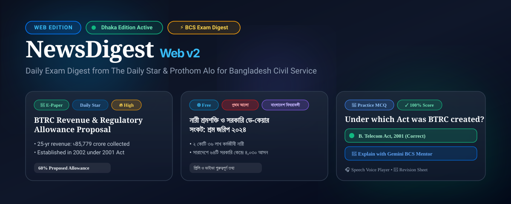
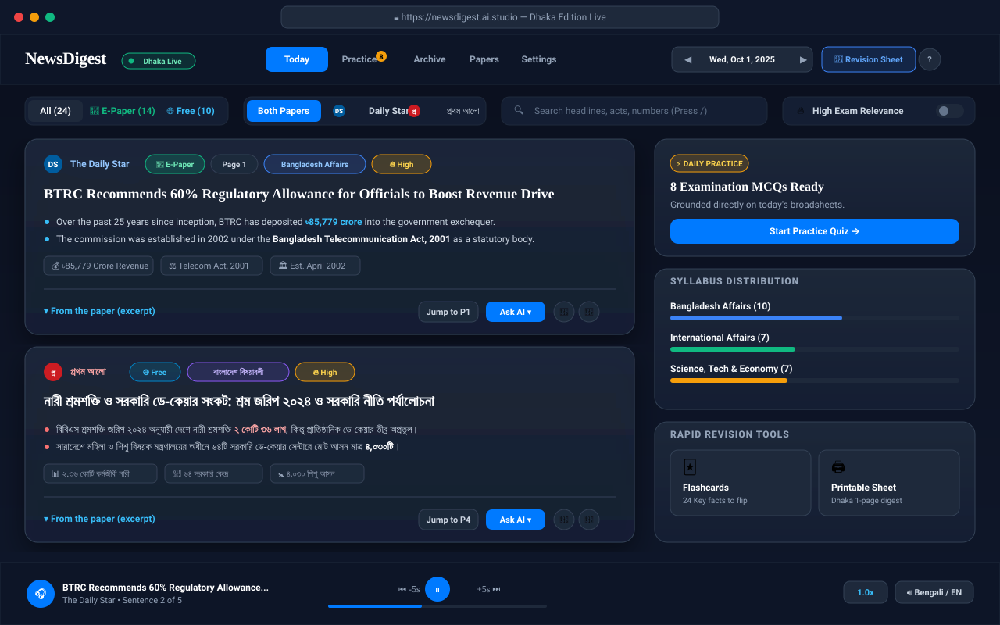
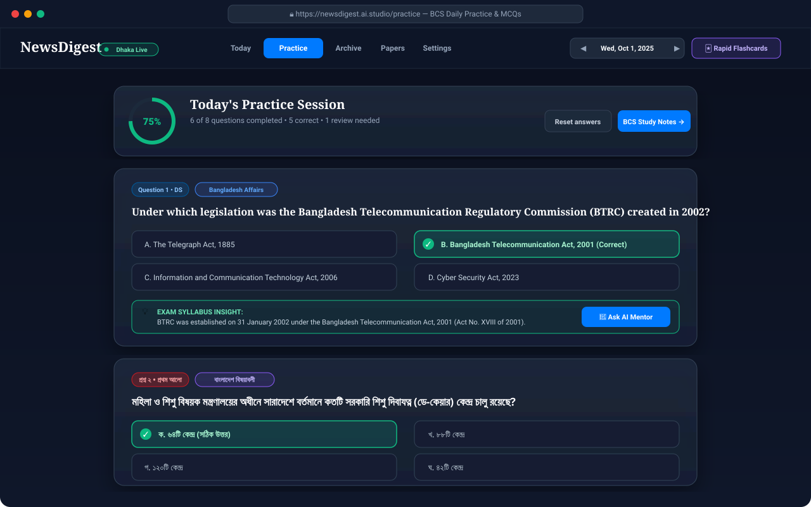
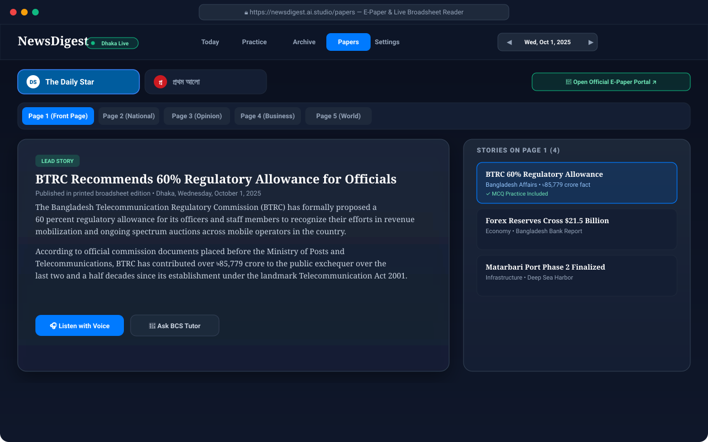
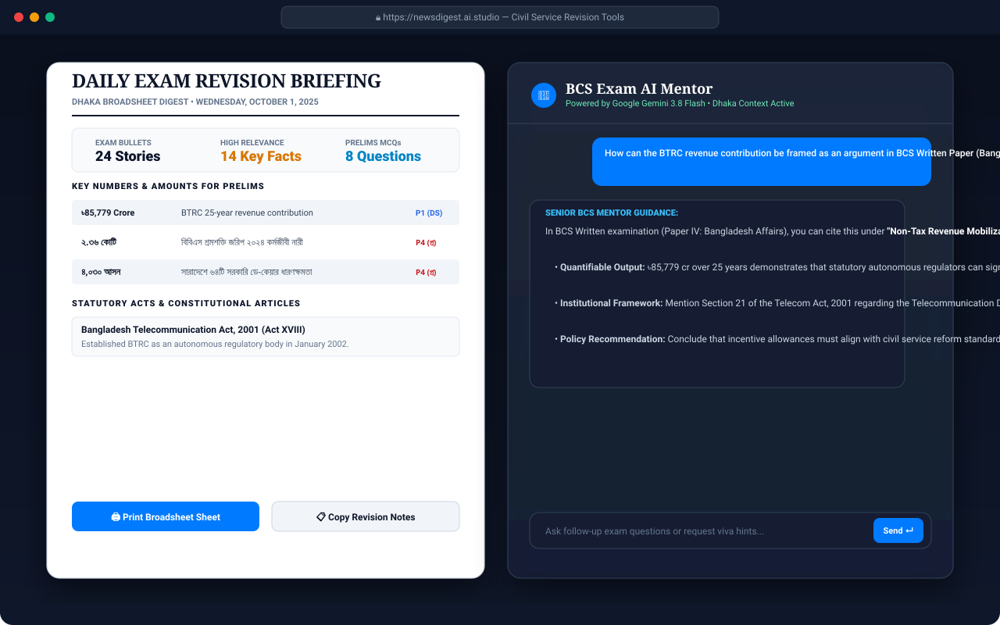

# NewsDigest (Web Edition)

<p align="center">
  
</p>

<p align="center">
  <a href="https://newsdigest.ai.studio/"></a>
  
  
  
  
</p>

🌐 **Live Web Application**: [https://newsdigest.ai.studio/](https://newsdigest.ai.studio/)

> **Daily newspaper digest for Bangladesh Civil Service (BCS) & competitive examination candidates**, built with React 19, TypeScript, Tailwind CSS, Express, and Google Gemini AI.

Fetches daily news from **The Daily Star** and **Prothom Alo**, categorizes them into BCS syllabus areas, extracts key exam facts and analytical bullets, produces practice MCQs, and provides an in-app AI study mentor and read-aloud voice player.

Web version based on [NewsDigest iOS](https://github.com/MachangDoniel/NewsDigest).

---

## 📸 Web Application Showcase

### 1. 📰 Today's Digest Feed & Desktop Study Inspector
Full desktop browser experience with dual-column layout: curated news organized by syllabus relevance on the left, and the real-time **BCS Study Inspector** on the right.

<p align="center">
  
</p>

- **Instant Search**: Reactive search across headlines, analytical bullets, and key exam facts (press `/`).
- **Edition Switcher**: Filter between `All`, `📰 E-Paper` (broadsheet replica from Supabase), and `🌐 Free` (live online feed).
- **Dhaka Date Stepper**: Jump between dates with `◀` / `▶` (or keys `J` / `K`) and calendar picker.
- **Segmented Paper Filter**: Filter by *Both Papers*, *Daily Star* (DS monogram in `#005c9e`), or *প্রথম আলো* (প্র monogram in `#cc1a21`).
- **BCS Study Inspector**: Live syllabus distribution tracker (Bangladesh Affairs, International, Science & Economy) and rapid flashcard shortcuts.
- **Desktop Audio Bar**: Persistent hands-free audio narration with sentence tracking, skip ±5s, and speed control.

---

### 2. 📝 Practice (Daily Examination MCQs & Score Ring)
Sharpen your preliminary exam score with multiple choice questions generated directly from today's newspaper articles.

<p align="center">
  
</p>

- **Interactive Score Ring**: Visual circular progress tracking answered questions and accuracy rate.
- **Instant Validation**: Clear green and red feedback states with detailed explanation notes.
- **🤖 Ask AI Mentor**: One-click contextual exam explanation powered by Google Gemini 3.8 Flash.

---

### 3. 🗞️ Broadsheet E-Paper Reader & Page Navigator
Read the original published morning broadsheet editions page-by-page.

<p align="center">
  
</p>

- **Page-by-Page Tabs**: Browse Front Page, National, Opinion, Business, and World (Pages 1–8).
- **Official E-Paper Jump**: Direct link to open the official digital replica portal.
- **Integrated Voice Narration**: One-tap "Listen with Voice" for any published broadsheet story.

---

### 4. 🖨️ Printable Broadsheet Revision Sheet & In-App AI Study Mentor
Comprehensive revision tools built specifically for civil service preliminary, written, and viva preparation.

<p align="center">
  
</p>

- **Printable Broadsheet Sheet**: Printable 1-page daily briefing of high-frequency numbers, statutory acts, and constitutional articles.
- **BCS Exam AI Mentor**: Interactive chat sheet to consult senior exam guidance, written arguments, and interview angles.

---

## 🌟 Key Capabilities Summary

| Feature | Web Edition Experience |
|---|---|
| 📰 **Today's Feed** | Dual-column responsive grid with syllabus tags, analytical bullets, and quote excerpts. |
| 🔍 **Live Search** | Instant reactive search across headlines, facts, keywords, and dates. |
| 🏷️ **E-Paper & Free** | Distinguishes printed broadsheet replicas (`E-Paper`) from online web articles (`Free`). |
| ⚡ **Revision Sheet** | Broadsheet-style printable revision summary of the day's high-frequency facts. |
| 🗂️ **Interactive Flashcards** | Rapid memorization tool for numbers, dates, and organizations. |
| 📝 **Practice MCQs** | Real daily Prelims questions with interactive circular score ring. |
| 🎧 **Voice Narrator** | Persistent bottom audio player with sentence tracking and speech speed. |
| 🗄️ **Archive & Bookmarks** | Complete historical date archive and bookmarked revision vault. |

---

## 🛠️ Tech Stack

- **Frontend**: React 19, TypeScript, Tailwind CSS, Lucide Icons
- **Backend**: Node.js, Express, Vite middlewares
- **Data & Feeds**: Real-time RSS parsers (`fast-xml-parser`), Supabase client (`@supabase/supabase-js`)
- **AI Engine**: `@google/genai` (Google Gen AI SDK with `gemini-3.8-flash`)
- **Voice Engine**: Web SpeechSynthesis API

---

## 🚀 Getting Started

### Prerequisites
- Node.js 18+
- npm or bun

### Installation

```bash
# Clone the repository
git clone https://github.com/MachangDoniel/NewsDigest-Web.git
cd NewsDigest-Web

# Install dependencies
npm install

# Start development server
npm run dev
```

Open [http://localhost:3000](http://localhost:3000) in your browser.

### Environment Variables (Optional)

Create a `.env` file in the root directory:

```env
# Optional: Gemini API Key for live AI summaries & in-app chat
GEMINI_API_KEY="your-gemini-api-key"

# Optional: Supabase project, for the e-paper digests (Project Settings -> API)
SUPABASE_URL="https://your-project.supabase.co"
SUPABASE_ANON_KEY="your-publishable-key"

# Optional: report visits to the NewsDigest iOS app's Admin screen
# (same value as the WEB_LOG_KEY secret on the Supabase project)
WEB_LOG_KEY="your-web-log-key"

# Port (defaults to 3000)
PORT=3000
```

No keys are stored in this repository. `.env` is ignored by git; on AI Studio the same names go in the **Secrets** panel.

---

## 🔒 Security & Limits

This is a public reader: there is no sign-in, no admin screen and no admin API on this site. Administration lives in the NewsDigest iOS app.

| Protection | Rule |
| :--- | :--- |
| **Requests per address** | 120 API requests a minute; over that the server answers `429` with `Retry-After`. |
| **AI per address** | 10 requests a minute to `/api/chat` and `/api/bcs-summary`. |
| **AI from everyone together** | 30 requests a minute and 600 a day, so changing address does not get around the limit. |
| **Request size** | Bodies up to 200 KB. Chat sends at most the last 12 messages (2,000 characters each) and 8,000 characters of story context to Gemini. |
| **Database** | The site reads `digests` and `run_status` with the publishable key. Row-level security makes them read-only; nothing here can write to them. |
| **Visit reporting** | At most one report every 30 seconds, 100 visits in it, 30 from one address. Off unless `SUPABASE_URL` and `WEB_LOG_KEY` are set. |

The limits are counted in memory, so they start again when the server restarts.

---

## ☁️ Deploying on AI Studio

1. In the **Secrets** panel set `GEMINI_API_KEY`, `SUPABASE_URL` and `SUPABASE_ANON_KEY` (and `WEB_LOG_KEY` if you use visit reporting).
2. Bring the app up to date with the `main` branch of this repository. `main` is the source of truth: do not put back the admin login, passcode, telemetry dashboard or any built-in key.
3. Publish.
4. Check the result. Each of these must answer `404`:

```bash
curl -s -o /dev/null -w "%{http_code}\n" https://newsdigest.ai.studio/api/auth/session
curl -s -o /dev/null -w "%{http_code}\n" https://newsdigest.ai.studio/api/admin/telemetry
curl -s -o /dev/null -w "%{http_code}\n" -X POST https://newsdigest.ai.studio/api/auth/passcode-login
```

and `https://newsdigest.ai.studio/api/digests?source=epaper&limit=1` must return a digest.

---

## 📄 License

This project is created for personal study and BCS preparation. Not affiliated with The Daily Star or Prothom Alo. All newspaper copyrights belong to their respective publishers.
