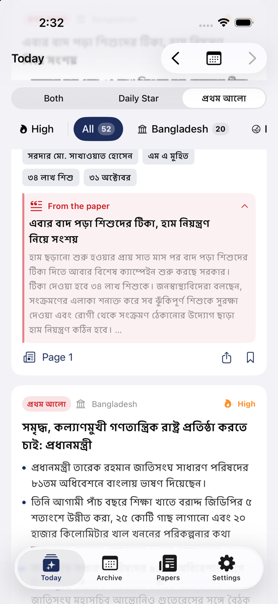
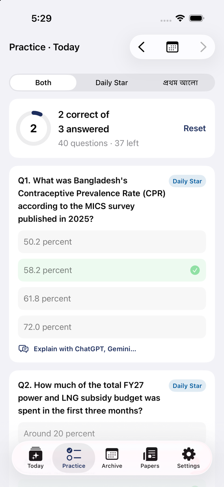
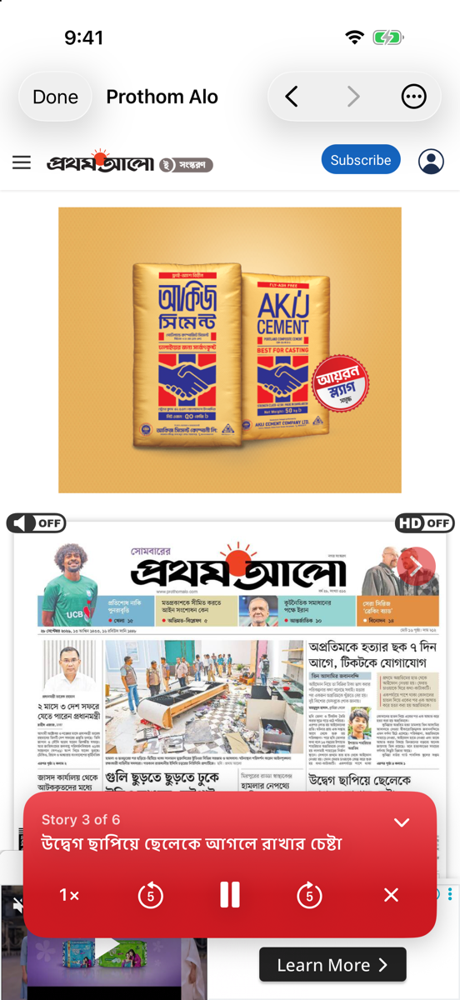
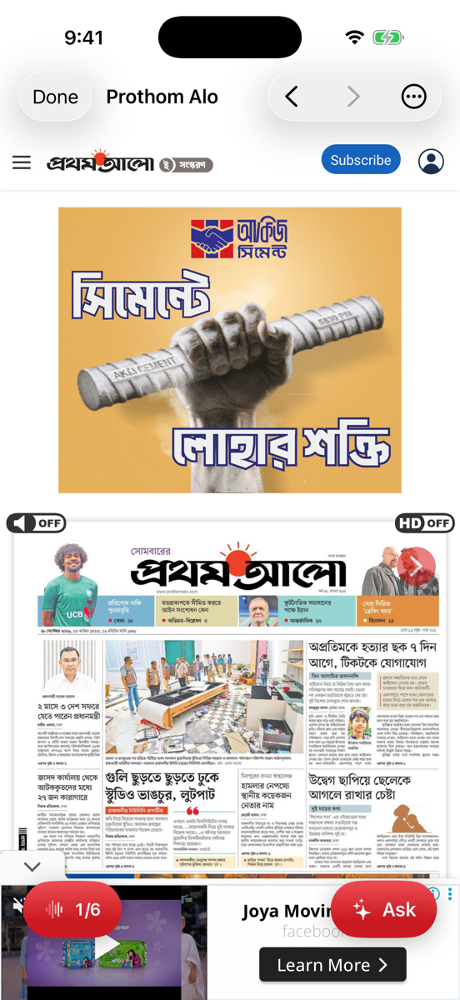
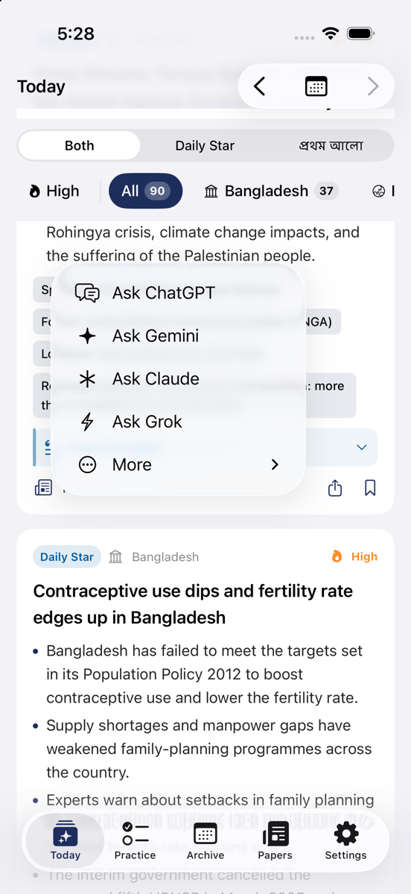
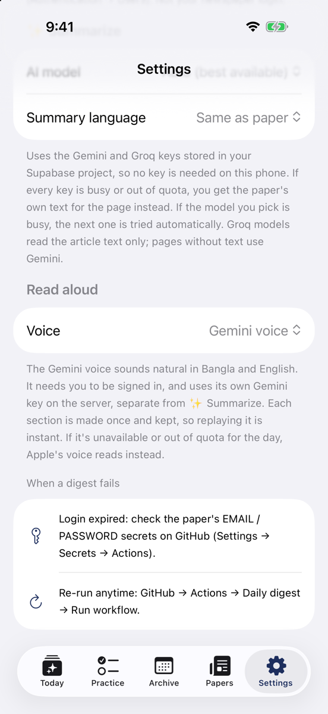

# NewsDigest (Web Edition)

<p align="center">
  
</p>

<p align="center">
  <a href="https://newsdigest.ai.studio/"></a>
  
  
  
  
</p>

🌐 **Live Web Application**: [https://newsdigest.ai.studio/](https://newsdigest.ai.studio/)

> **Daily newspaper digest for Bangladesh Civil Service (BCS) & competitive examination candidates**, built with React 19, TypeScript, Tailwind CSS, Express, and Google Gemini AI.

Fetches daily news from **The Daily Star** and **Prothom Alo**, categorizes them into BCS syllabus areas, extracts key exam facts and analytical bullets, produces practice MCQs, and provides an in-app AI study mentor and read-aloud voice player.

Web version based on [NewsDigest iOS](https://github.com/MachangDoniel/NewsDigest).

---

## 📸 Screenshots & Highlights

### 1. 📰 Today's Digest & Broadsheet Excerpts
Browse daily curated news organized by syllabus relevance, with instant edition filtering (**E-Paper** vs. **Free**), date navigation, and collapsible quotes from the original newspaper.

<p align="center">
  
  &nbsp;&nbsp;&nbsp;&nbsp;
  
</p>

- **Instant Search**: Quick search icon and reactive filter bar searching headlines, bullets, and exam facts in real time.
- **Edition Switcher**: Filter between `All`, `📰 E-Paper` (broadsheet replica from Supabase), and `🌐 Free` (live web feed).
- **Dhaka Date Stepper**: Jump between dates or open the interactive calendar modal.
- **Segmented Paper Filter**: Filter by *Both Papers*, *Daily Star* (DS monogram in `#005c9e`), or *প্রথম আলো* (প্র monogram in `#cc1a21`).
- **High-Yield Tags**: Key numbers, dates, organizations, and statutory acts marked for Prelims and Viva.

---

### 2. 📝 Practice (Daily Examination MCQs)
Sharpen your preliminary exam score with multiple choice questions generated directly from today's newspaper articles.

<p align="center">
  
</p>

- **Interactive Score Ring**: Visual circular progress tracking answered and correct questions.
- **Instant Validation**: Clear green and red feedback states with explanation notes.
- **Explain with AI**: One-click contextual explanation powered by Google Gemini.

---

### 3. 🗞️ Papers & Read Aloud Voice Player
Read the original published editions or have stories narrated sentence-by-sentence with the built-in speech engine.

<p align="center">
  
  &nbsp;
  
  &nbsp;
  
</p>

- **Page-by-Page Navigation**: Browse Page 1 through 18+ for both newspapers.
- **View Original E-Paper**: Direct one-tap jump to the official digital replica sites.
- **Read Aloud Audio Pill**: Plays aloud with pause, skip, speed control (0.75x–1.5x), and folds into a minimal pill while listening.

---

### 4. 🤖 In-App AI Study Assistant & Ask AI Menu
Integrate study workflows with leading AI models or chat with the built-in BCS mentor.

<p align="center">
  
  &nbsp;&nbsp;&nbsp;&nbsp;
  
</p>

- **Pre-Configured Exam Prompts**: Quick launch into ChatGPT, Gemini, Claude, Grok, Perplexity, and DeepSeek.
- **Interactive Chat Sheet**: Discuss syllabus points, constitutional angles, and economic significance directly inside the web app.

---

### 5. ⚙️ Settings & Speech Voice Customization
Tailor your study experience with model choice, speech pitch, voice speed, and database sync.

<p align="center">
  
</p>

---

## 🌟 Key Capabilities Summary

| Feature | Description |
|---|---|
| 📰 **Today's Feed** | Factual headlines, 2–3 analytical bullets, and syllabus categorization. |
| 🔍 **Live Search** | Instant full-text search across headlines, facts, and excerpt quotes. |
| 🏷️ **E-Paper & Free** | Distinguishes printed broadsheet replicas (`E-Paper`) from online web articles (`Free`). |
| ⚡ **Revision Sheet** | Broadsheet-style printable revision summary of the day's high-frequency facts. |
| 🗂️ **Interactive Flashcards** | Rapid memorization tool for numbers, dates, and names. |
| 📝 **Practice MCQs** | Real daily Prelims questions with score ring and instant AI explanations. |
| 🎧 **Voice Narrator** | Listen to stories hands-free with background audio pill. |
| 🗄️ **Archive & Bookmarks** | Complete historical date archive and bookmarked revision vault. |
| 🌐 **Supabase Sync** | Built-in Supabase database connection with custom project support. |

---

## 🛠️ Tech Stack

- **Frontend**: React 19, TypeScript, Tailwind CSS, Lucide Icons
- **Backend**: Node.js, Express, Vite middlewares
- **Data & Feeds**: Real-time RSS parsers (`fast-xml-parser`), Supabase client (`@supabase/supabase-js`)
- **AI Engine**: `@google/genai` (Google Gen AI SDK with `gemini-3.8-flash`)
- **Voice Engine**: Web SpeechSynthesis API

---

## 🚀 Getting Started

### Prerequisites
- Node.js 18+
- npm or bun

### Installation

```bash
# Clone the repository
git clone https://github.com/MachangDoniel/NewsDigest-Web.git
cd NewsDigest-Web

# Install dependencies
npm install

# Start development server
npm run dev
```

Open [http://localhost:3000](http://localhost:3000) in your browser.

### Environment Variables (Optional)

Create a `.env` file in the root directory:

```env
# Optional: Gemini API Key for live AI summaries & in-app chat
GEMINI_API_KEY="your-gemini-api-key"

# Port (defaults to 3000)
PORT=3000
```

---

## 📄 License

This project is created for personal study and BCS preparation. Not affiliated with The Daily Star or Prothom Alo. All newspaper copyrights belong to their respective publishers.
